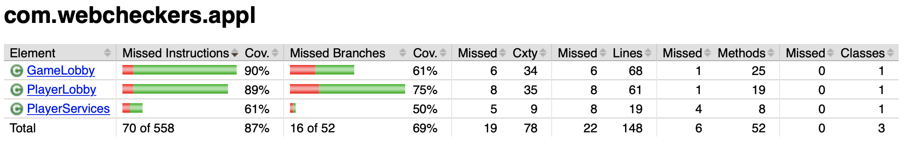

# PROJECT Design Documentation

## Team Information
* Team name: Wizards
* Team members
 * Anthony Prestia (atp4280)
 * Van Pham (vnp7514)
 * Kevin Murcia Garcia (krm7205)
 * Brody Wrighter (baw9895)

## Executive Summary

The WebCheckers application must let two users who are signed in to play a game of checkers. This application has one feature that sets it apart from a basic checkers game:

* Spectate games that are currently in session 

### Purpose

A web-based application for users to play/spectate games of checkers.

### Glossary and Acronyms

| Term | Definition |
|------|------------|
| VO | Value Object |

## Requirements

The main functionality for our program are to make sure
a player can sign in, sign out, and play a game.
Once a player is signed in they can challenge another
signed in player. When a game is in session the player
must be able to move a piece, submit a piece, redo a move
(before submission) and also resign if they so please.

### Definition of MVP

Our minimal viable product consists of many stories that allow
the user to sign in, sign out, and play a game with another
player.

### MVP Features

* As a Player I want to sign-in so that I can play a game of checkers
* As a Player I want to start a game so that I can play checkers with an opponent
* As a Player I want to make a move so that I know whether my move is valid
* As a Player, I want to be able to undo a move so I can perform the best moves possible
* As a Player, I want to show my opponent the moves I have made so my opponent can respond to my moves 
* As a Player I want to be able to resign from a game so I can end a game early
* As a Player I would like my piece to be able to turn my piece into a King in order to follow the rules of American checkers
* As a Player, I want to be able to end the game according to the rules so I can either win or lose the game 

### Roadmap of Enhancements

* Spectator Mode (Implemented)
* Replay Mode (Currently not implemented)

## Application Domain

This section describes the application domain.

The WebCheckers application can have any number of games occurring simultaneously. Each game must have 2 players and any number of spectators. Each game will be saved as a replay for users to watch at a later time.

## Architecture and Design

This section describes the application architecture.

### Summary

The following Tiers/Layers model shows a high-level view of the webapp's architecture.

As a web application, the user interacts with the system using a
browser.  The client-side of the UI is composed of HTML pages with
some minimal CSS for styling the page.  There is also some JavaScript
that has been provided to the team by the architect.

The server-side tiers include the UI Tier that is composed of UI Controllers and Views.
Controllers are built using the Spark framework and View are built using the FreeMarker framework.  The Application and Model tiers are built using plain-old Java objects (POJOs).

Details of the components within these tiers are supplied below.

### Overview of User Interface

This section describes the web interface flow; this is how the user views and interacts
with the WebCheckers application.

Once the user is connected to the server, the Home page is rendered. The user then must click on the sign in button to sign in before they are able to play a game. Clicking the sign in page will render the Sign-In page. The user must provide a valid and unique username.  Once the user chooses a valid username, the Home page is rendered. Now the option to play a game is available to the user. The user now challenges another player to a match. Once the challenge is accepted, the Game page is rendered.

### UI Tier
> _Provide a summary of the Server-side UI tier of your architecture.
> Describe the types of components in the tier and describe their
> responsibilities.  This should be a narrative description, i.e. it has
> a flow or "story line" that the reader can follow._

> _At appropriate places as part of this narrative provide one or more
> static models (UML class structure or object diagrams) with some
> details such as critical attributes and methods._

> _You must also provide any dynamic models, such as statechart and
> sequence diagrams, as is relevant to a particular aspect of the design
> that you are describing.  For example, in WebCheckers you might create
> a sequence diagram of the `POST /validateMove` HTTP request processing
> or you might show a statechart diagram if the Game component uses a
> state machine to manage the game._

> _If a dynamic model, such as a statechart describes a feature that is
> not mostly in this tier and cuts across multiple tiers, you can
> consider placing the narrative description of that feature in a
> separate section for describing significant features. Place this after
> you describe the design of the three tiers._

The UI Tier is responsible for rendering the HTML page and if necessary, dealing with Ajax actions.

GetGameRoute renders the /game page according to the state of the game.
It renders the page for three different situations: the game is currently going,
the game has a quitter and the game has a winner.
It also reroutes if the user has not signed in or tried to access an 
unavailable game.  

GetHomeRoute renders the / page. It is in charge of showing the list of
players to challenge and a list of ongoing games if the current user has 
signed in. It is also in charge of removing the GameLobby instance when
all players and spectators have left the lobby.

GetSignInRoute renders the /signin page. It tells the users whether their
usernames are acceptable or not. If the usernames are acceptable, the users are
redirected to the / page.

GetSpectateGameRoute renders the /spectate/game page. It starts the process of 
spectating an ongoing game.

GetSpectateStopWatchingRoute handles the removal of a spectator from a game.

PostBackupMoveRoute handles the Backup button on the /game page. It will removes
the last move that was performed on the board.

PostCheckTurnRoute checks if the current user can have their turn. If they can
then the /game Page is rendered so that the player can perform moves.

PostGameRoute is responsible for informing the server that a game has been
made between two Players.

PostResignRoute is responsible for informing the sever that someone has
resigned and the game that the player is in should be terminated.

PostSignInRoute validates the username that the user entered to see
whether it is acceptable.

PostSignOutRoute removes a signed in Player from the PlayerLobby.

PostSpectatorCheckTurnRoute informs the client that the game state has
changed and the page should be updated.

PostSubmitTurnRoute validates the set of moves that the current user made. Then
It will inform the server that the user has finished their turn.

PostValidateMoveRoute validates a move that was made by the player. The move
is sent through Gson so this route deciphers that info and validates the info. 

Below is the Sequence Diagram of how a User can sign in and get into a game:

### Application Tier

The Application Tier contains classes that store data that the workinng session can
 access. Our Application Tier consists of three classes; the GameLobby, the PlayerLobby
 and PlayerServices.

GameLobby consists of two players who are playing in this
 game, a BoardView instance which represents the board shared between the two
 players, and variable that keeps track of whose turn it is to make a move.
 An instance of a GameLobby is stored within a PlayerLobby.
 
PlayerLobby consists of a list of all players who are currently signed in,
 a list of GameLobby to keep track of every game instance running. PlayerLobby
 is a server based instance and there is only ever one instance of PlayerLobby
 that is shared between all players.
 
PlayerServices is how we keep track of client side functionality. When a new
 player logs into the server a PlayerServices instance is assigned to the client
 and is then used to pass information to various function calls such as telling
 the server what GameLobby they are in, or what move they are making, or what
 UI they should be seeing.

### Model Tier

The Model Tier contains classes that represent the data being used to dictate what
 happens after a game has been made, for instance the board contains all the pieces
 stored in their positions that can be moved.

### Design Improvements

We could make an abstract class called User which Player and Spectator would extend so the Player class is not
responsible for spectating and playing

Get rid of duplicate code by making the duplicate code into its own function which would be called instead

## Testing
> _This section will provide information about the testing performed
> and the results of the testing._

### Acceptance Testing
> _Report on the number of user stories that have passed all their
> acceptance criteria tests, the number that have some acceptance
> criteria tests failing, and the number of user stories that
> have not had any testing yet. Highlight the issues found during
> acceptance testing and if there are any concerns._

### Unit Testing and Code Coverage

Model Tier

Our model tier code coverage is pretty high. This is because of the unit tests that 
we created on the BoardView class. Our BoardView class is a complete representation 
of a board. It holds the pieces and validates moves that are trying to be made on the
board. Using different edge cases and examples of moves we were able to gain a lot
of coverage.

UI Tier

Our UI tier has lower coverage because this tier specifically was a lot harder
to test with unit testing. We decided as a team to instead focus primarily on real time
testing with our web application to make sure that the UI was correct and handled all kinds
of combination of players online doing separate actions that might have interactions with
other players and their active UI, etc etc. So while our code coverage is low for this
tier we believe that sufficient testing was done to ensure that the product we produced is
bug free.

Application Tier

Our application tier code coverage is pretty high. We were able to do extensive testing on
the classes based in this tier very early into development. The classes in the application
tier hold player information and the game information in respect to the players logged into
the webapp and the games being played on the webapp.