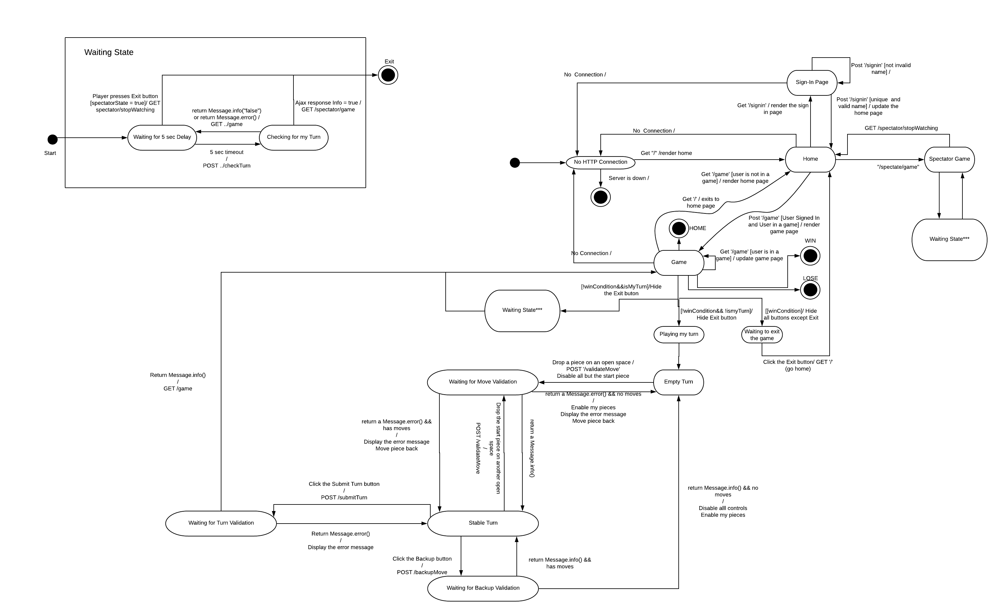

# PROJECT Design Documentation

> _The following template provides the headings for your Design
> Documentation.  As you edit each section make sure you remove these
> commentary 'blockquotes'; the lines that start with a > character
> and appear in the generated PDF in italics._

## Team Information
* Team name: Wizards
* Team members
 * Anthony Prestia (atp4280)
 * Van Pham (vnp7514)
 * Kevin Murcia Garcia (krm7205)
 * Brody Wrighter (baw9895)

## Executive Summary

The WebCheckers application must let two users who are signed in to play a game of checkers. This application has two features that set it apart from a basic checkers game:

* Spectate games that are currently in session
* Watch a replay of a game 

### Purpose

A web-based application for users to play/spectate games of checkers.

### Glossary and Acronyms

| Term | Definition |
|------|------------|
| VO | Value Object |

## Requirements

The main functionality for our program are to make sure
a player can sign in, sign out, and play a game.
Once a player is signed in they can challenge another
signed in player. When a game is in session the player
must be able to move a piece, submit a piece, redo a move
(before submission) and also resign if they so please.

### Definition of MVP

Our minimal viable product consists of many stories that allow
the user to sign in, sign out, and play a game with another
player.

### MVP Features
> _Provide a list of top-level Epics and/or Stories of the MVP._

### Roadmap of Enhancements
> _Provide a list of top-level features in the order you plan to consider them._

## Application Domain

This section describes the application domain.

The WebCheckers application can have any number of games occurring simultaneously. Each game must have 2 players and any number of spectators. Each game will be saved as a replay for users to watch at a later time.

## Architecture and Design

This section describes the application architecture.

### Summary

The following Tiers/Layers model shows a high-level view of the webapp's architecture.

As a web application, the user interacts with the system using a
browser.  The client-side of the UI is composed of HTML pages with
some minimal CSS for styling the page.  There is also some JavaScript
that has been provided to the team by the architect.

The server-side tiers include the UI Tier that is composed of UI Controllers and Views.
Controllers are built using the Spark framework and View are built using the FreeMarker framework.  The Application and Model tiers are built using plain-old Java objects (POJOs).

Details of the components within these tiers are supplied below.

### Overview of User Interface

This section describes the web interface flow; this is how the user views and interacts
with the WebCheckers application.

Once the user is connected to the server, the Home page is rendered. The user then must click on the sign in button to sign in before they are able to play a game. Clicking the sign in page will render the Sign-In page. The user must provide a valid and unique username.  Once the user chooses a valid username, the Home page is rendered. Now the option to play a game is available to the user. The user now challenges another player to a match. Once the challenge is accepted, the Game page is rendered.

### UI Tier
> _Provide a summary of the Server-side UI tier of your architecture.
> Describe the types of components in the tier and describe their
> responsibilities.  This should be a narrative description, i.e. it has
> a flow or "story line" that the reader can follow._

> _At appropriate places as part of this narrative provide one or more
> static models (UML class structure or object diagrams) with some
> details such as critical attributes and methods._

> _You must also provide any dynamic models, such as statechart and
> sequence diagrams, as is relevant to a particular aspect of the design
> that you are describing.  For example, in WebCheckers you might create
> a sequence diagram of the `POST /validateMove` HTTP request processing
> or you might show a statechart diagram if the Game component uses a
> state machine to manage the game._

> _If a dynamic model, such as a statechart describes a feature that is
> not mostly in this tier and cuts across multiple tiers, you can
> consider placing the narrative description of that feature in a
> separate section for describing significant features. Place this after
> you describe the design of the three tiers._

### Application Tier

The Application Tier contains classes that store data that the workinng session can
 access. Our Application Tier consists of three classes; the GameLobby, the PlayerLobby
 and PlayerServices.

GameLobby consists of two players who are playing in this
 game, a BoardView instance which represents the board shared between the two
 players, and variable that keeps track of whose turn it is to make a move.
 An instance of a GameLobby is stored within a PlayerLobby.
 
PlayerLobby consists of a list of all players who are currently signed in,
 a list of GameLobby to keep track of every game instance running. PlayerLobby
 is a server based instance and there is only ever one instance of PlayerLobby
 that is shared between all players.
 
PlayerServices is how we keep track of client side functionality. When a new
 player logs into the server a PlayerServices instance is assigned to the client
 and is then used to pass information to various function calls such as telling
 the server what GameLobby they are in, or what move they are making, or what
 UI they should be seeing.

### Model Tier

The Model Tier contains classes that represent the data being used to dictate what
 happens after a game has been made, for instance the board contains all the pieces
 stored in their positions that can be moved.

### Design Improvements

One thing we could implement to help make our design better is by creating
   a class that checks the validity of a move and a jump as we discussed during
   the Presentation my group gave on 4/2/2020 at around 2pm EST. This would
   help reduce coupling within our program because as of right now a lot of the
   functionality is stored in the BoardView class which can be problematic
   down the road.

## Testing
> _This section will provide information about the testing performed
> and the results of the testing._

### Acceptance Testing
> _Report on the number of user stories that have passed all their
> acceptance criteria tests, the number that have some acceptance
> criteria tests failing, and the number of user stories that
> have not had any testing yet. Highlight the issues found during
> acceptance testing and if there are any concerns._

### Unit Testing and Code Coverage

While we have not yet fully implemented all of our program's unit
   testing and our Code Coverage is very low because of it, we have done
   a lot of stress testing by having every member of our group run and play the
   game and try as hard as we could to break the program. As of right now we know
   of two bugs that need to be fixed:
   1. In certain cases (have not yet been able to reliably recreate the error)
       while submitting a move, it will not give the player an error if they are making a
       non jump move while a jump move exists for them to make.
   2. At the end of a game when someone has won, the game does not end by itself. The
       only way to end the game is by having a player Resign.
